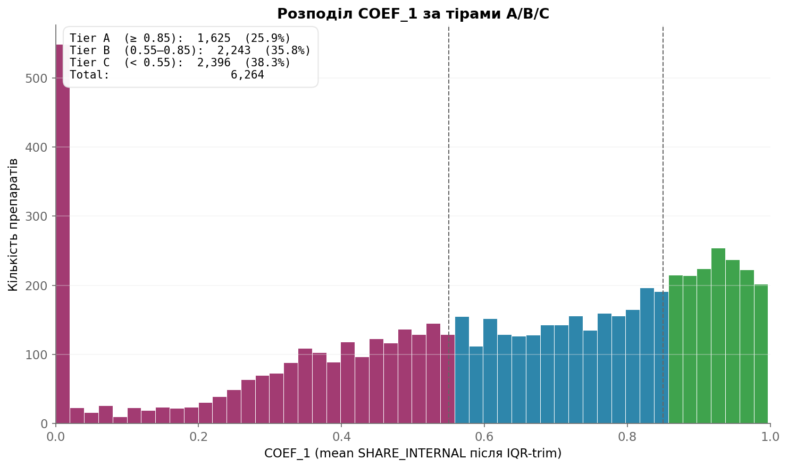
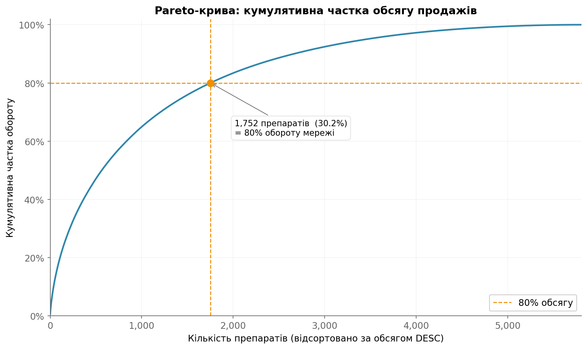
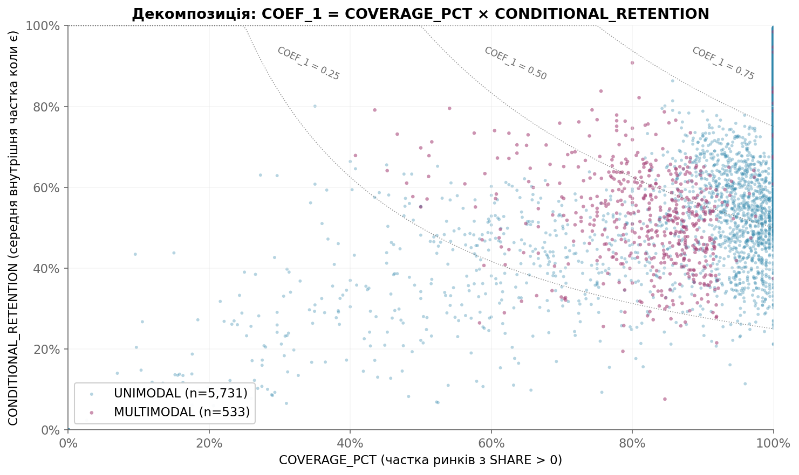
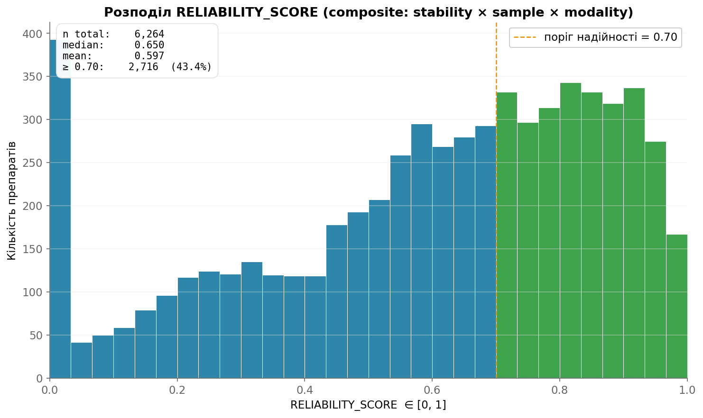

# Drug Substitution Engine

> **Кількісний пайплайн, що для кожного препарату аптечної мережі рахує, яка частка попиту залишається всередині мережі, коли цей препарат закінчується — і куди реально йде втрачений попит.**

[🇬🇧 English →](README.md)  ·  [Методологія](docs/ALGORITHMS.md)  ·  [Звіти](reports/)  ·  [Безпека та дані](SECURITY.md)

[](https://github.com/radyslav-datascience/drug_substitution_engine)


[](https://github.com/radyslav-datascience/drug_substitution_engine/stargazers)

---

## Що це таке

Аптечна мережа втрачає виторг щоразу, коли клієнт виходить без потрібного препарату. Стратегічне питання — **не** «як часто у нас немає в наявності» (це операційне), а: **коли немає, клієнт купує замінник у нас чи йде?**

Цей engine відповідає на це питання для **6 264 препаратів** на **150+ локальних ринків** (OPT-коди ≈ місто/район), використовуючи дизайн «різниця-в-різницях» (DiD) на стокаутах. Кожен препарат отримує:

- `COEF_1` — середня частка попиту, яку мережа утримує під час відсутності препарату (після IQR-trim по ринках).
- `COVERAGE_PCT × CONDITIONAL_RETENTION` — декомпозиція, що показує *чому* `COEF_1` саме такий.
- `RELIABILITY_SCORE` — композитна впевненість у `COEF_1` (стабільність по CV × log-сатурований розмір вибірки × штраф за модальність).
- `DRUG_CLASS` — `UNIMODAL` / `MULTIMODAL` (Hartigan dip test) — флаг для препаратів, де середнє статистично оманливе.
- 16 валідаційних інваріантів, всі зелені.

Результат живить tier-based-стратегію наявності (A: critical / B: standard / C: watch) і Power BI-воркбук, який аналітик відкриває без додаткової роботи.

---

## Методологія в чотирьох графіках

<table>
<tr>
<td width="50%">

**Розподіл `COEF_1` — тіри A/B/C**



**1 625 препаратів (25.9 %) — sticky** (`COEF_1 ≥ 0.85` — мережа утримує попит навіть під час стокауту).
**2 396 препаратів (38.3 %) — vulnerable** (`COEF_1 < 0.55` — більшість попиту йде з мережі).

</td>
<td width="50%">

**Pareto-крива за обсягом продажів**



**30 % каталогу дають 80 % обороту.** Цей cutoff використовується для пріоритизованої стратегії наявності й для аналітичних експортів.

</td>
</tr>
<tr>
<td width="50%">

**Декомпозиція: COEF_1 = COVERAGE × CONDITIONAL**



Препарат із `COEF_1 = 0.50` може бути **(а)** утриманим у 100 % ринків наполовину, або **(б)** повністю утриманим лише в 50 % ринків і повністю втраченим в інших. На одному числі ці два сценарії виглядають однаково — на scatter видно, що ні.

</td>
<td width="50%">

**Надійність оцінки**



**2 716 препаратів (43.4 %)** мають `RELIABILITY ≥ 0.70`. Решта публікується з тим самим `COEF_1`, але прапор `RELIABILITY_SCORE` вказує downstream-споживачам, що оцінка шумніша (мала вибірка, висока CV по ринках, або бімодальний розподіл).

</td>
</tr>
</table>

> Усі чотири графіки генерує [`_optional_calculations/visualizations/run_visualizations.py`](_optional_calculations/visualizations/run_visualizations.py) безпосередньо з `results/final/drug_coefficients.csv`.

---

## Зміст

- [Швидкий старт](#швидкий-старт)
- [Pipeline](#pipeline)
- [Виходи](#виходи)
- [Ключові формули](#ключові-формули)
- [Архітектурні принципи](#архітектурні-принципи)
- [Структура проекту](#структура-проекту)
- [Документація](#документація)
- [Конфіденційність даних](#конфіденційність-даних)
- [Технологічний стек](#технологічний-стек)
- [Ліцензія та автор](#ліцензія-та-автор)

---

## Швидкий старт

```bash
# Windows — запуск одним кліком
run.bat

# Або з CLI
python -m pipeline.full_run                       # повний прогон, поріг 20 ринків
python -m pipeline.full_run --limit 5             # smoke-test на 5 ринках
python -m pipeline.full_run --workers 4           # 4 воркери замість 6
python -m pipeline.full_run --force               # ігнорувати parquet-кеш
python -m pipeline.full_run --min-market-count 3  # м'якший поріг
```

Прогон на референсному датасеті (≈30 ГБ raw CSV) займає **~45 хвилин** на 6 ядрах / 32 ГБ RAM. Pipeline **resume-aware**: кожен per-market parquet перевіряється на пошкодження при завантаженні, перерваний прогон підхоплює там, де зупинився.

Engine — dataset-agnostic. Щоб запустити на власних даних аптечної мережі, покладіть транзакційні CSV у `data/raw/` за схемою з [`docs/_data_format.md`](docs/_data_format.md). Референсна NFC1-таблиця завантажується з `data/master/nfc1_config.json`.

---

## Pipeline

```
Raw CSV (data/raw/*.csv)
   │
   ▼
Phase A0: Discover markets ─────────────────► markets_list.csv
   │
   ▼
Phase A: Per-market processing  (паралельно × N воркерів)
   ├─ A1  Агрегація даних            ─► aggregated.parquet
   ├─ A2  Виявлення стокаутів        ─► stockout_events.parquet
   ├─ A3  DiD-аналіз                 ─► did_events.parquet + substitute_pairs.parquet
   └─ A4  Аналіз substitute-часток   ─► substitute_shares.parquet
   │
   ▼
Phase B: Cross-market агрегація ────────────► drug_statistics.parquet
   │                                          (broad: ВСІ препарати, повна видимість)
   ▼
Phase C: Final export ──────────────────────► 4 файли для замовника
                                              (narrow: фільтр phantom-рядків,
                                               застосування інваріантів)
```

Патерн «broad model, narrow export» — свідомий: Phase B зберігає кожен intermediate-рядок, тому дебаг залишається дешевим, а Phase C — єдине місце, де живуть customer-facing-фільтри. Баг у downstream-фільтрі ніколи не псує upstream-математику тихо.

Live Rich-based TUI dashboard показує per-market прогрес, ETA та валідаційні інваріанти під час прогону.

---

## Виходи

Усі фінальні файли — у `results/final/`:

| Файл | Опис | Рядків |
|------|------|--------|
| `drug_coefficients.csv` / `.xlsx` | Один рядок на препарат — `DRUGS_ID, DRUG_CLASS, COEF_1, UNIQUENESS_COEF, COVERAGE_PCT, CONDITIONAL_RETENTION, MARKETS_WITH_SUB, MARKET_COUNT, RELIABILITY_SCORE, DRUGS_NAME, INN_ID, INN_NAME, NFC1_ID` | 6 264 |
| `substitute_shares.csv` / `.xlsx` | Source-drug → substitute-drug пари з cross-market частками | 134 081 |
| `validation_report.txt` | 16 інваріантів (`DC_RELIABILITY_IN_0_1`, `DC_DECOMPOSE_FORMULA`, `SS_NO_PHANTOMS`, …) — всі зелені |  |

Супровідна документація у `reports/`:

- `business_report.txt` — наратив для стейкхолдерів (tier-based-стратегія, top movers, методологічні нюанси).
- `data_dictionary.txt` — кожна колонка виходу з формулою, одиницями, валідним діапазоном і прикладами.

---

## Ключові формули

```
SHARE_INTERNAL_m = INTERNAL_LIFT_m / (INTERNAL_LIFT_m + LOST_SALES_m)
                                                              ◄ на ринку m

COEF_1           = mean( IQR_trim_1.5( {SHARE_INTERNAL_m | m ∈ markets} ) )
                                                              ◄ по ринках

COEF_1           = COVERAGE_PCT × CONDITIONAL_RETENTION       ◄ декомпозиція
   COVERAGE_PCT  = | { m : SHARE_INTERNAL_m > 0 } | / | markets |
   CONDITIONAL_RETENTION = mean( SHARE_INTERNAL_m | SHARE_INTERNAL_m > 0 )

RELIABILITY_SCORE = stability × sample_factor × modality_penalty
   stability         = 1 − CV(SHARE_INTERNAL_m)               ∈ [0, 1]
   sample_factor     = log10(1 + n_markets) / log10(1 + 150)  саторується на n=150
   modality_penalty  = 0.85  якщо  DRUG_CLASS = MULTIMODAL  інакше 1.00

DRUG_CLASS         = MULTIMODAL  якщо Hartigan dip test p < 0.05  інакше UNIMODAL
```

Чому середнє (а не медіана) на `SHARE_INTERNAL`? Оскільки IQR-trim уже зрізає довгі хвости, середнє зберігає більше сигналу на верхньому кінці розподілу, де концентрується утримання. `_methods_issues.md::ISSUE-013` детально описує цю зміну.

Чому декомпозиція? Одне число `COEF_1 = 0.50` неоднозначне (див. scatter вище). Видача оператору одночасно `COVERAGE_PCT` і `CONDITIONAL_RETENTION` робить цю неоднозначність видимою — і це принципово для `MULTIMODAL`-препаратів, де середнє лежить між двома справжніми модами.

Чому композитна надійність? Per-drug-впевненість залежить від трьох незалежних речей: наскільки share стабільний по ринках (`stability`), у скількох ринках препарат з'явився (`sample_factor`), чи має розподіл часток одну моду чи кілька (`modality_penalty`). Згортка в одне `[0, 1]`-число дозволяє аналітику сортувати й порогувати без жонглювання трьома полями.

---

## Архітектурні принципи

1. **Pipeline і ad-hoc — фізично розділені.** `pipeline/` — locked-in продакшн-код, чіпається тільки при логуванні методологічного issue в `docs/_methods_issues.md`. Ad-hoc-аналітика живе в `_optional_calculations/<task>/` зі своїм `config.py`, `run_*.py`, `inputs/`, `outputs/`, `logs/`. Вони залежать від пайплайну; пайплайн ніколи не залежить від них.

2. **Broad model, narrow export.** Phase B зберігає кожен препарат — phantom-substitutes, low-coverage-рядки, все. Phase C — єдине місце, де живе customer-facing-фільтр (`SHARE > 0`, `MARKET_COUNT ≥ N`, тощо). Дебаг лишається дешевим; продакшн — чистим.

3. **Math first, code second.** Кожен коефіцієнт має формулу в `docs/ALGORITHMS.md`, валідаційний інваріант у `validation_report.txt` і рядок у `data_dictionary.txt`. Якщо ці три не сходяться — engine відмовляється публікувати.

4. **Resume-aware, corruption-checked.** Per-market parquets перевалідовуються при завантаженні; частково записаний кеш виявляється і перебудовується. 45-хвилинний прогон може пережити перезавантаження ядра.

5. **Єдине джерело істини для NFC1.** `data/master/nfc1_config.json` — єдине місце, де живе реєстр NFC1-сімейств. Pipeline, ad-hoc-задачі, звіти — всі читають його.

---

## Структура проекту

```
drug_substitution_engine/
├── pipeline/                       Продакшн-код (не чіпати без methods-issue)
│   ├── full_run.py                 Entrypoint з TUI dashboard
│   ├── runner.py                   Phase A orchestrator (ProcessPoolExecutor)
│   ├── phase_a_*.py                Per-market воркери (A1–A4)
│   ├── cross_market.py             Phase B агрегація
│   └── final_export.py             Phase C — customer-файли + інваріанти
│
├── core/                           Перевикористовувані примітиви (DiD-математика,
│                                   NFC1-lookup, виявлення стокаутів, parquet-helper)
├── config/                         Константи (пороги, шляхи, схеми)
│
├── data/                           ◄ НЕ в репо — клієнтські дані
│   ├── raw/                        Транзакційні CSV
│   ├── intermediate/               Per-market parquet-кеш
│   └── master/nfc1_config.json     NFC1-реєстр
│
├── results/                        ◄ НЕ в репо — клієнтські виходи
│   └── final/                      4 файли для Power BI + валідація
│
├── reports/                        Знеособлені методологічні звіти (в репо)
│   ├── business_report.txt
│   ├── data_dictionary.txt
│   └── validation_report.txt
│
├── docs/                           Методологічні документи
│   ├── ROADMAP.md
│   ├── ALGORITHMS.md               Формули та виведення
│   ├── LOGS.md                     Хронологічний лог робіт
│   └── _methods_issues.md          Журнал методологічних інцидентів
│
├── _optional_calculations/         Ad-hoc-аналітика (залежить від пайплайну)
│   ├── top_1k_reliability_sales_volume/   Reliability × Pareto subset для аналітика
│   └── visualizations/             4 PNG для цього README
│
├── logs/                           ◄ НЕ в репо — runtime-логи
│
├── CLAUDE_BRIEFING.md              Швидкий онбординг для AI/human-колаборантів
├── SECURITY.md                     Що є та чого немає в цьому репо
├── LICENSE                         Proprietary
├── README.md                       Англійська версія (основна)
└── README_UA.md                    (цей файл)
```

---

## Документація

| Документ | Що містить |
|----------|------------|
| [`docs/ROADMAP.md`](docs/ROADMAP.md) | План проекту й архітектурні рішення |
| [`docs/ALGORITHMS.md`](docs/ALGORITHMS.md) | Усі формули з виведеннями |
| [`docs/LOGS.md`](docs/LOGS.md) | Хронологічний лог робіт (кожен крок, кожне рішення) |
| [`docs/_methods_issues.md`](docs/_methods_issues.md) | Журнал методологічних інцидентів (ISSUE-013…016) |
| [`reports/business_report.txt`](reports/business_report.txt) | Наратив для стейкхолдерів — тіри, top movers, нюанси |
| [`reports/data_dictionary.txt`](reports/data_dictionary.txt) | Per-column-словник — формула, одиниці, діапазон |
| [`reports/validation_report.txt`](reports/validation_report.txt) | 16 інваріантів, всі зелені |
| [`CLAUDE_BRIEFING.md`](CLAUDE_BRIEFING.md) | One-pager для нових колаборантів |

---

## Конфіденційність даних

Цей репозиторій містить **тільки код, методологію та агреговані/знеособлені звіти**. Клієнтські дані виключені через `.gitignore` і ніколи не потрапляють у публічну історію. Конкретно:

- ❌ `data/raw/`, `data/intermediate/`, `data/master/*.json` — клієнтські транзакційні дані та NFC1-конфігурація.
- ❌ `results/final/*` — drug-level-вихідні файли (зберігаються локально; структура папок збережена через `.gitkeep`).
- ❌ `_optional_calculations/*/inputs/`, `_optional_calculations/*/outputs/` — analyst-facing-проміжні файли.
- ❌ `logs/` — runtime-логи можуть містити реальні `CLIENT_ID`.
- ✅ Назви препаратів, INN, NFC1 — залишені (публічний фарма-довідник, ідентичний у всіх постачальників).
- ✅ Звіти у `reports/` — явно знеособлені; замовник згадується як "the pharmacy chain".

Повні деталі та адреса для responsible disclosure: [`SECURITY.md`](SECURITY.md).

---

## Технологічний стек

- **Python 3.13** — `pandas`, `numpy`, `pyarrow`, `scipy.stats` (Hartigan dip test), `openpyxl`, `rich` (TUI).
- **Storage** — Parquet (Snappy) для проміжних; CSV/XLSX для customer-facing-експортів.
- **Паралелізм** — `ProcessPoolExecutor` з N воркерами (default 6, авто-детект через `psutil`).
- **Валідація** — власний invariant-runner (16 перевірок); пайплайн відмовляється публікувати на red.
- **Графіки (цей README)** — `matplotlib` 3.10.

---

## Ліцензія та автор

Source code — **proprietary**, див. [`LICENSE`](LICENSE). Методологія, формули та звіти у `reports/` опубліковані для портфоліо й освітнього використання; запуск engine на власних даних потребує письмового дозволу.

**Радислав Ломанов** — Senior Data Scientist, фарма-аналітика
[lomanov.mail@gmail.com](mailto:lomanov.mail@gmail.com)  ·  [t.me/radyslav_datascience](https://t.me/radyslav_datascience)  ·  [WhatsApp +38 (095) 035-94-05](https://wa.me/380950359405)
